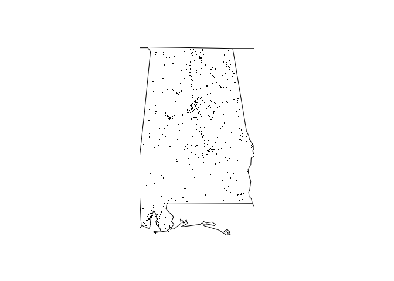

<!-- README.md is generated from README.Rmd. Please edit that file -->

# examplepackage

<!-- badges: start -->

<!-- badges: end -->

This is an example R package built for Coursera’s Mastering Software
Development in R course 2: Building an R Package.

This Package loads, summarizes, and plots US National Highway Traffic
Safety Administration’s Fatality Analysis Reporting System
([source](https://www.nhtsa.gov/research-data/fatality-analysis-reporting-system-fars)),
with yearly data on fatal injuries suffered in motor vehicle traffic
crashes.

## Installation

You can install from github:

``` r
#> devtools::install_github([path to this repository])
```

## Usage

To load package once installed:

``` r
library(examplepackage)
```

The package provides utility functions to: \* access the data in a data
frame \* summarize accidents by year \* plot the data by state against a
map of the US using the `maps` package. Note that if `datadir` argument
is not provided, built-in data is loaded automatically.

To access raw data in a data
frame:

``` r
df = fars_read(filename = 'accident_2013.csv.bz2',   # filename of the built-in dataset for 2013
               datadir = NULL)                       # this loads from the built-in datasets
head(df)
#> # A tibble: 6 x 50
#>   STATE ST_CASE VE_TOTAL VE_FORMS PVH_INVL  PEDS PERNOTMVIT PERMVIT PERSONS
#>   <dbl>   <dbl>    <dbl>    <dbl>    <dbl> <dbl>      <dbl>   <dbl>   <dbl>
#> 1     1   10001        1        1        0     0          0       8       8
#> 2     1   10002        2        2        0     0          0       2       2
#> 3     1   10003        1        1        0     0          0       1       1
#> 4     1   10004        1        1        0     0          0       3       3
#> 5     1   10005        2        2        0     0          0       3       3
#> 6     1   10006        2        2        0     0          0       3       3
#> # … with 41 more variables: COUNTY <dbl>, CITY <dbl>, DAY <dbl>,
#> #   MONTH <dbl>, YEAR <dbl>, DAY_WEEK <dbl>, HOUR <dbl>, MINUTE <dbl>,
#> #   NHS <dbl>, ROAD_FNC <dbl>, ROUTE <dbl>, TWAY_ID <chr>, TWAY_ID2 <chr>,
#> #   MILEPT <dbl>, LATITUDE <dbl>, LONGITUD <dbl>, SP_JUR <dbl>,
#> #   HARM_EV <dbl>, MAN_COLL <dbl>, RELJCT1 <dbl>, RELJCT2 <dbl>,
#> #   TYP_INT <dbl>, WRK_ZONE <dbl>, REL_ROAD <dbl>, LGT_COND <dbl>,
#> #   WEATHER1 <dbl>, WEATHER2 <dbl>, WEATHER <dbl>, SCH_BUS <dbl>,
#> #   RAIL <chr>, NOT_HOUR <dbl>, NOT_MIN <dbl>, ARR_HOUR <dbl>,
#> #   ARR_MIN <dbl>, HOSP_HR <dbl>, HOSP_MN <dbl>, CF1 <dbl>, CF2 <dbl>,
#> #   CF3 <dbl>, FATALS <dbl>, DRUNK_DR <dbl>
```

To summarize the data:

``` r
fars_summarize_years(c(2013, 2014))
#> # A tibble: 12 x 3
#>    MONTH `2013` `2014`
#>    <dbl>  <int>  <int>
#>  1     1   2230   2168
#>  2     2   1952   1893
#>  3     3   2356   2245
#>  4     4   2300   2308
#>  5     5   2532   2596
#>  6     6   2692   2583
#>  7     7   2660   2696
#>  8     8   2899   2800
#>  9     9   2741   2618
#> 10    10   2768   2831
#> 11    11   2615   2714
#> 12    12   2457   2604
```

To plot the location of fatalities for state indexed 1 for year 2013:

``` r
fars_map_state(1, 2013)
```


